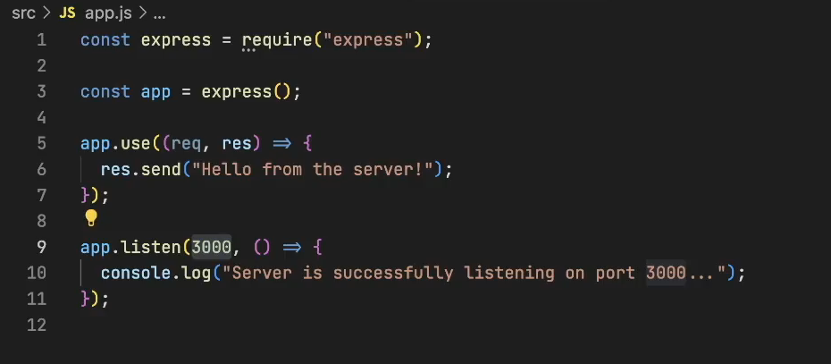
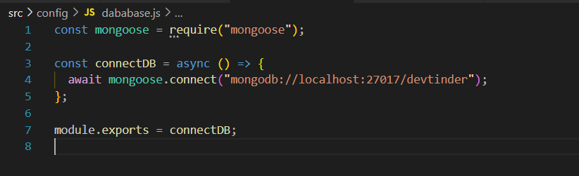
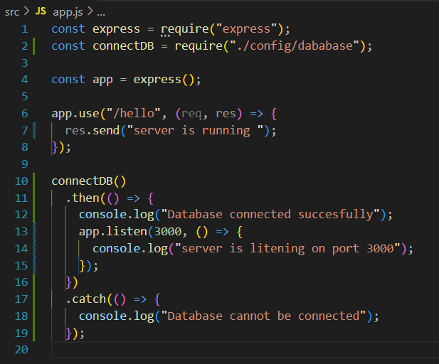
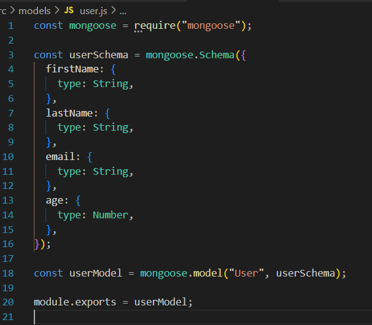
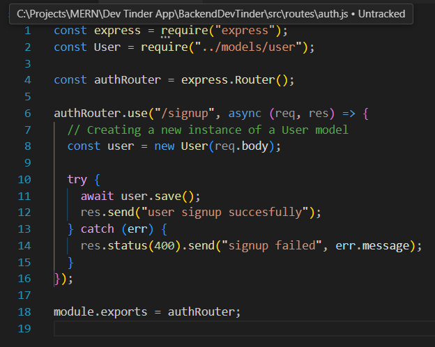
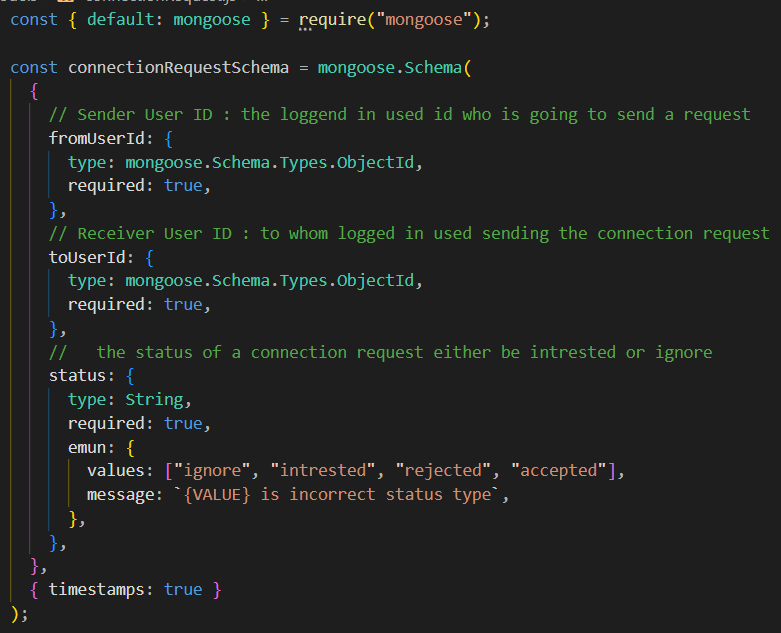
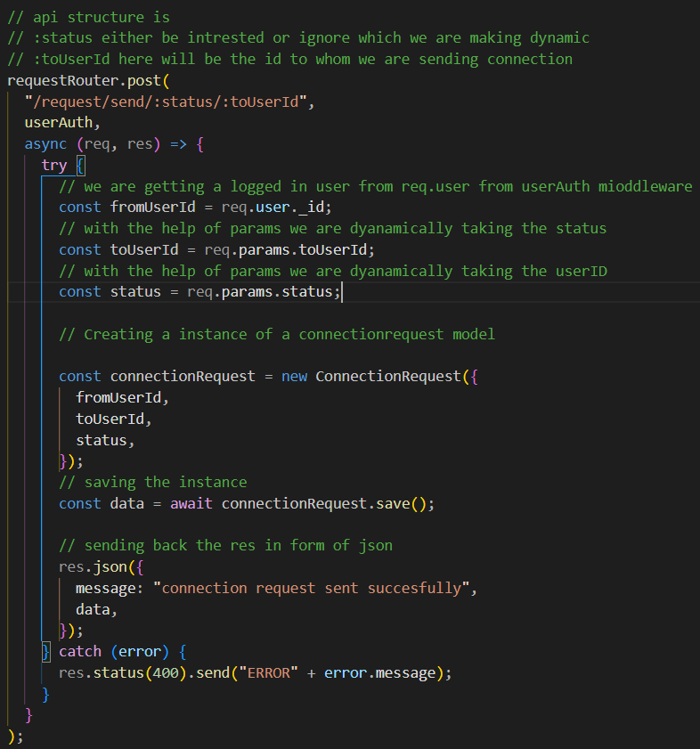
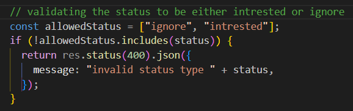
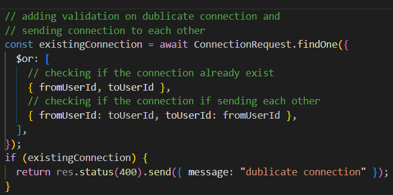

# Project setup

- npm init
- Folder > src > app.js
- Install Express
- Create .gitignore file > node_modules
- In App.js create server
- 
  <!-- -  -->
- Install nodemon

# Git

- Create a git repositary
- Push the code

# Cluster

- Go to mongoDB website
- Create a free M0 cluster
- Create user
- Get the connection string

# MongoDB

- Create a config folder > database.js
- Install mongoose
- in database.js > import mongoose > create async connectDB function > paste dabaseURL mongoDB shell
- 
- Export connectDB function to app.js(so that first we will connect to database and then will run the server)
- 

# Postman

- After creating the differnt api's
- Start Testing on postman
- Workspace > black collection > New > HTTP

# REST API's

- Get, Post, Patch, Delete

# Middleware's

- Create a folder middleware in src folder
- Write a middleware (Middleware > auth.js) for different routes
- To use middleware for route,export from middleware file
- Import middleware in route file and write after the path (eg "./test",userAuth,()={})

# Schemas & Models

- Create a models folder > user.js file
- Write the following code
- 

# API's

- Create a Route folder > auth.js file
- Import express > declare route > write a indivisual route > export the route
- 

- Will start writing API'S
- Import User model in API
- for eg we will write signup API
- Here we will create new instance of User model by following image code
- To make it dynamic we will use req.body

---

- To make the API working import it in app.js
- To convert the request data into JSON format add a middleware app.use(express.json())
- Declare a router
- Use the app.use("/") to direct the route to indivisual route

# JWT TOKEN & COOKIE PARSAR

- We here creating a token in login api
- After checking the password before login we will set a token so that it will be created as soon as user login
- In a login api in isPasswordCorrect add a
  const token = await jwt.sign({ \_id: user.\_id }, "DEV@123");
  sending token throug req.cookie and will receive through cookie
  res.cookie("token", token);
  just with this 2 line of code we have genrated a token

- 
- with this we have send token from login

- PROFILE API
- Now we are receiving the token from login API
- To read the cookie token we need external package cookie parser
- Import it and give middleware app.use(cookieParser()) in app.js
- To receive to differnt route we need jwt code
- 

# MIDDLEWARES

- create a folder - src > middlewares > auth.js
- Here we will write the same authentication code we wrote in profile api
- which we will make a common auth which we can use in multiple profiles
- 

# EXPIRING THE TOKENS AND COOKIES

- In a login API where we have set the jwt.sign
  there we will pass extra a parameter as {Expires in : 7d}
- To expire the cookies we will pass paramater in res.cookies
- 

# SCHEMA METHODS

- we will shift the jwt token code to User Schema file(models > user.js) just for a good pratice
- 
- after shifting we have to make certain changes in our login API
- 

# API's TO BUILD

## authRouter

- POST /signup
- POST /login
- POST /logout

## profileRouter

- GET /profile/view
- PATCH /profile/edit
- PATCH /profile/password

## Connection request router

- POST /request/send/intrested/:userId
- POST /request/send/ignored/:userId
- [POST /request/send/:status/:userId]
- POST /request/review/accepted/:requestId
- POST /request/review/rejected/:requestId
- [POST /request/review/:status/:requestId]

# CONNECTION API

## Sending Connection request API

- creating a seprate Schema - models > connectionRequest
- 
- in a request route make a new api "/request/send/:status/:toUserId",
- 
- in api need to validate a status type before crteating a instatnce
- 
- validating the dublicate connection
- 

# FEED API
