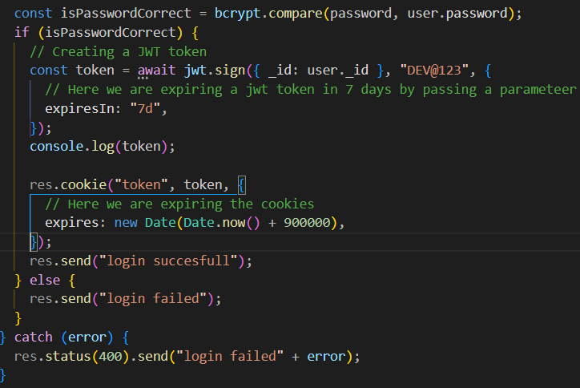
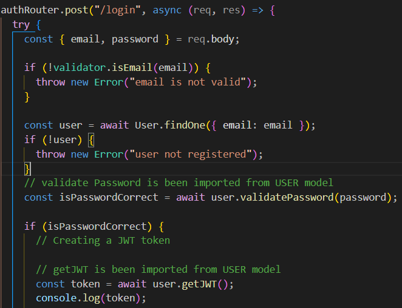

# JWT TOKEN & COOKIE PARSAR

- We line create a token in login api
- After checking the password before login we will set a token so that it will be created as soon as user login
- In a login api in isPasswordCorrect add a
  const token = await jwt.sign({ \_id: user.\_id }, "DEV@123");
  sending token throug req.cookie and will receive through cookie
  res.cookie("token", token);
  just with this 2 line of code we have genrated a token

- 
- with this we have send token from login

- PROFILE API
- Now we are receiving the token from login API
- To read the cookie token we need external package cookie parser
- Import it and give middleware app.use(cookieParser()) in app.js
- To receive to differnt route we need jwt code
- 

# MIDDLEWARES

- create a folder - src > middlewares > auth.js
- Here we will write the same authentication code we wrote in profile api
- which we will make a common auth which we can use in multiple profiles
- 

# EXPIRING THE TOKENS AND COOKIES

- In a login API where we have set the jwt.sign
  there we will pass extra a parameter as {Expires in : 7d}
- To expire the cookies we will pass paramater in res.cookies
- 

# SCHEMA METHODS

- we will shift the jwt token code to User Schema file(models > user.js) just for a good pratice
- 
- after shifting we have to make certain changes in our login API
- 

# API's TO BUILD

## authRouter

- POST /signup
- POST /login
- POST /logout

## profileRouter

- GET /profile/view
- PATCH /profile/edit
- PATCH /profile/password

## Connection request router

- POST /request/send/intrested/:userId
- POST /request/send/ignored/:userId
- POST /request/review/accepted/:requestId
- POST /request/review/rejected/:requestId
